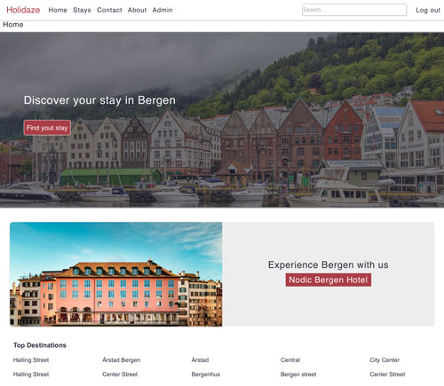

# Project Exam 2



### Holidaze

This project is to create a webiste for a local tourism agency in Bergen called ‘Holidaze’.

### Table of Contents

- [Description](#description)
- [Built With](#built-with)
- [Getting Started](#getting-started)
- [Contact](#contact)

## Description

This project is to create a website for a local tourism agency in Bergen called ‘Holidaze’ for visitors to the area to be able to find hotels, B&Bs and guesthouses, and for the accommodation owners to receive enquiries. as well as the administration side where properties can be added and enquiries managed.

- To provide visitors find accommodation

## Built With

- [React-Bootstrap](https://react-bootstrap.github.io/)
- [React.js](https://reactjs.org)
- [Sass](https://sass-lang.com/)

## Getting Started

### Installing

1. Clone the repo:

```bash
git clone https://github.com/HamoudBalawi/project-exam2
```

2. Install the dependencies:

To install NPM packages, run the following commands:

```bash
npm install
```

### start

To start, run the following commands:

```bash
npm run start
```

### develop

To develop, run the following commands:

```bash
npm run develop
```

### build

To build, run the following commands:

```bash
npm install -g serve
npm run build
serve -s build
```

## Contact

[Instagram](https://www.instagram.com/hamoud_balawi/)

[Back To The Top](#eco-shoe)
